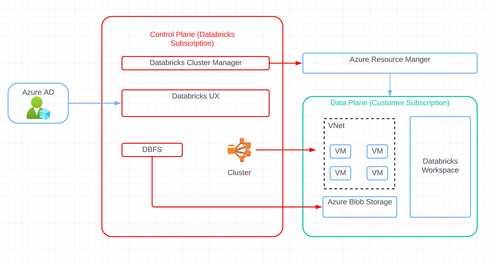

# IDS 706 Data Engineering Week 11 Individual Project 3

## Overview of Project

This individual project is to utilize Databricks to build a data pipeline.

Databricks Architecture:



Deme Video 

## Goal
* Creat a data ETL pipeline using Databricks
* Store the data in Delta Lake
* Utilize Spark SQL for data transforations
* Provide data visualizations of the transformed data
* create an automated trigger to initiate the pipeline

## Dataset
The dataset is composed of 266 countries' 1965-2015 years population growth in annual percentage. You can access the data from the following URL: [population.csv] https://raw.githubusercontent.com/Kay1223/Population-Model/master/populationCR.csv

## File Structure in the repository are:

```bash
.
├── Dockerfile
├── LICENSE
├── Makefile
├── README.md
├── data
│   └── population.csv
├── image.png
├── main.py
├── mylib
│   ├── __init__.py
│   ├── extract.py
│   ├── query_viz.py
│   └── transform_load.py
├── requirements.txt
├── test_main.py
└── trigger.py
```

## Load Data

## Extract Data

## Tranform Data

## Viz


## Result of `make format`, `make lint`, and `make test`


## Colab working environment


